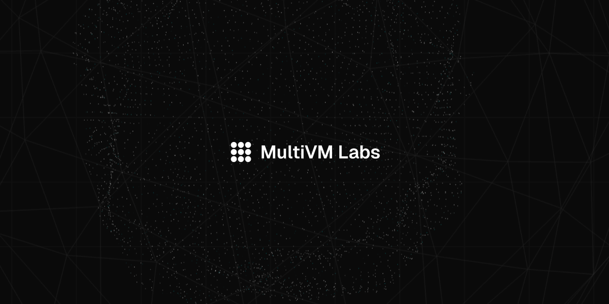

# About MultiVM Labs

MultiVM Labs is an R&D lab building Quantum, the Layer 1 network designed from genesis for post-quantum security.

## Designed From First Principles

#### POST-QUANTUM FROM GENESIS

No legacy cryptography. No migration debt. No emergency upgrades. Quantum uses NIST-standardized signatures from day zero.

#### NATIVE QUANTUM EXECUTION

Quantum execution at Layer 1. Simulation today, hardware tomorrow. Same interface, same guarantees.

#### BUILT-IN COMPUTE MARKETS

A decentralized marketplace for quantum simulation and hardware, coordinated by the QUBIT token.

## The Ecosystem We’re Building

#### QUANTUM

A new Layer 1 blockchain built from scratch with post-quantum cryptography. Not a fork. Not an upgrade. The chain designed to outlast Q-Day.

#### QUANTUM EXECUTION LAYER (QEL)

The first blockchain runtime where quantum jobs are native. Submit circuits, run simulations, verify results, settle payments. All on-chain.

#### $QUBIT

The native token powering Quantum. Stake to validate, pay for execution, earn from compute. Economic coordination for quantum workloads.

#### QUANTUM MARKETPLACE

Permissionless access to quantum computation. Workers compete, users submit jobs, verification ensures honesty. A new market built into the protocol.
